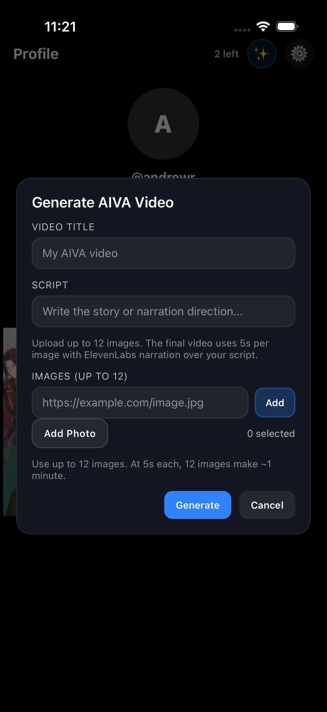

# AIVA

AIVA is a full-stack mobile app for browsing a short-video feed and generating AI videos from image uploads.  
The project has:

- `Frontend/`: Expo + React Native client (`App.js` contains the main app flow)
- `Backend/`: Node.js + Express API with PostgreSQL storage

## Screenshots




## How It Works

### App flow

1. User authenticates with phone + OTP and a password.
2. Frontend stores a session token in `AsyncStorage`.
3. Frontend calls backend APIs for:
   - profile/session state (`/auth/me`)
   - feed loading and interactions (`/feed`, likes, comments, views)
   - AIVA generation + status (`/aiva/generate`, `/aiva/status`)
4. Backend persists users, sessions, feed data, and generation jobs in Postgres.

### AI video generation flow

1. User selects/upload images in the app.
2. Frontend sends images + prompt data to backend.
3. Backend orchestrates external providers:
   - OpenAI (prompt/content shaping)
   - ElevenLabs (voice/narration)
4. Backend uses `ffmpeg` to stitch/finalize output.
5. Final video is saved under `Backend/uploads/videos` and appears in feed.

## Tech Stack

- Frontend: Expo 54, React Native 0.81, React 19
- Backend: Express 4, `pg`, `multer`
- Database: PostgreSQL (Neon works)
- Media processing: `ffmpeg`

## Project Structure

```text
Aiva/
  Frontend/
    App.js
    CommentsSection.js
    package.json
  Backend/
    server.js
    uploads/
    package.json
```

## Prerequisites

- Node.js 18+
- npm
- PostgreSQL database URL
- `ffmpeg` installed and available in PATH (or set `FFMPEG_BINARY`)

## Setup

### 1. Backend

```bash
cd Backend
npm install
```

Create `Backend/.env` with required values:

```env
DATABASE_URL=postgresql://...
PG_SSL=true
PORT=3001

# Required for auth SMS
TWILIO_ACCOUNT_SID=...
TWILIO_AUTH_TOKEN=...
TWILIO_VERIFY_SERVICE_SID=...

# Required for AIVA generation
OPENAI_API_KEY=...
ELEVENLABS_API_KEY=...
ELEVENLABS_VOICE_ID=...
```

Optional backend env vars:

- `PUBLIC_BASE_URL`
- `OPENAI_API_BASE`, `OPENAI_MODEL`
- `ELEVENLABS_API_BASE`, `ELEVENLABS_MODEL_ID`
- `AIVA_MAX_IMAGES`, `AIVA_SECONDS_PER_IMAGE`, `AIVA_SCENE_COUNT`, `AIVA_PROMPT_TEXT`, `AIVA_PROMPT_IMAGE_URL`
- `AUTH_OTP_TTL_MS`, `AUTH_SESSION_TTL_MS`
- `PG_POOL_MAX`, `PG_IDLE_TIMEOUT_MS`, `PG_CONNECTION_TIMEOUT_MS`, `PG_KEEPALIVE_INITIAL_DELAY_MS`

Run backend:

```bash
npm start
```

The backend auto-creates/updates required tables on startup (`initDb()` in `server.js`).

### 2. Frontend

```bash
cd Frontend
npm install
```

Create `Frontend/.env`:

```env
EXPO_PUBLIC_API_BASE_URL=http://localhost:3001
```

Run frontend:

```bash
npm start
```

Then launch iOS/Android from Expo.

## API Overview

Common routes in `Backend/server.js`:

- Health: `GET /health`
- Auth:
  - `POST /auth/register/start`
  - `POST /auth/register/verify`
  - `POST /auth/login/start`
  - `POST /auth/login/verify`
  - `GET /auth/me`
  - `POST /auth/logout`
  - `POST /auth/change-password/start`
  - `POST /auth/change-password/verify`
  - `POST /auth/change-phone/start`
  - `POST /auth/change-phone/verify`
- AIVA:
  - `POST /aiva/prompt-image`
  - `POST /aiva/generate`
  - `GET /aiva/status`
  - `POST /aiva/reward-ad-view`
  - `POST /aiva/reset-upload-count`
- Feed/social:
  - `GET /feed`
  - `POST /feed/:id/like`
  - `POST /feed/:id/comments`
  - `POST /feed/:id/view`
  - `DELETE /feed/:id`
  - `GET /following`
  - `POST /following/:username`
  - `DELETE /channels/:username`

## Troubleshooting

- React Native error `No suitable URL request handler found for localhost:3001/...`:
  - Ensure `EXPO_PUBLIC_API_BASE_URL` includes `http://` or `https://`.
- Real device cannot reach backend on `localhost`:
  - Use your machine LAN IP, e.g. `http://192.168.x.x:3001`.
- Backend `ETIMEDOUT` to Postgres:
  - Verify network/VPN/firewall and database availability.
  - Tune `PG_CONNECTION_TIMEOUT_MS` and pool-related env vars.

## Notes

- Uploaded/generated media is stored under `Backend/uploads`.
- `node_modules` is committed locally in this workspace; for normal repos, keep it ignored.
